# API Link

 Create job through **Postman** by using **POST method**  -  https://job-app-nrgt.onrender.com/api/jobs

See all list of available jobs  -  https://job-app-nrgt.onrender.com/api/jobs

 Update job through **Postman** by using **PUT method**   -  https://job-app-nrgt.onrender.com/api/jobs/id    at the place of **id** in URL get actual **id** from list of avilable job and put that **id value** at the place of id 

Delete job through **Postman** by using **DELETE method**   -  https://job-app-nrgt.onrender.com/api/jobs/id    at the place of **id** in URL get actual **id** from list of avilable job and put that **id value** at the place of id 

## Images
#### Create job
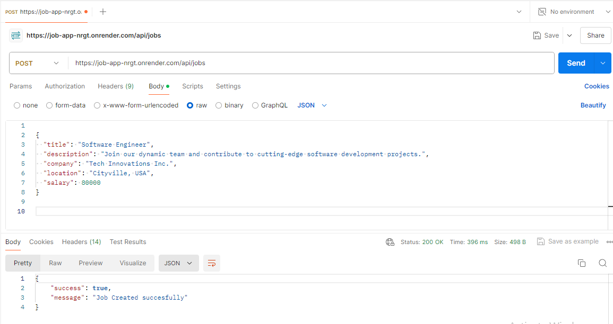 
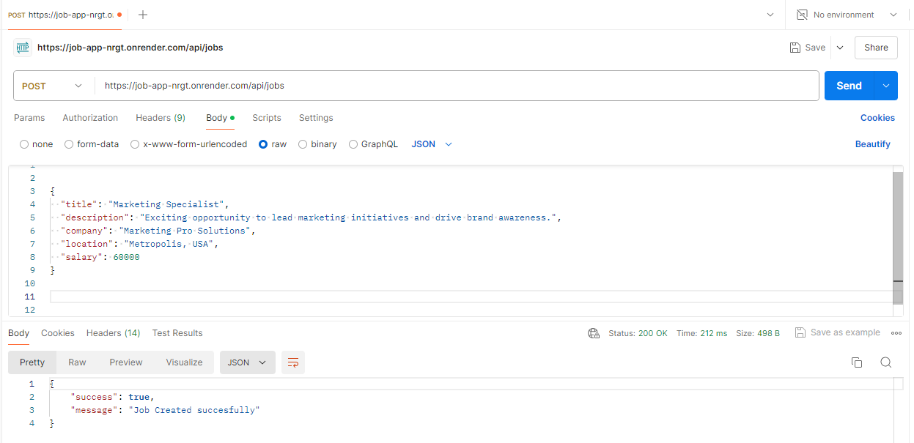 
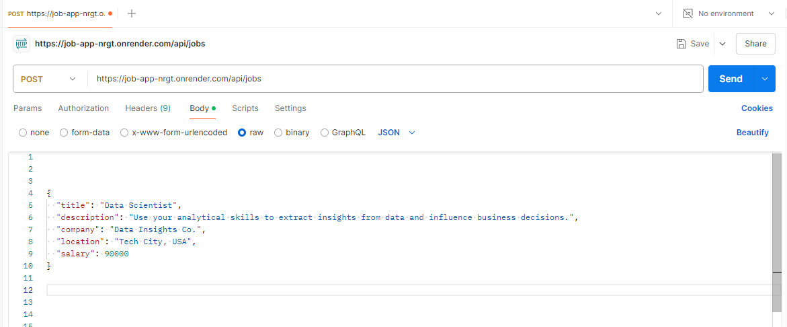 
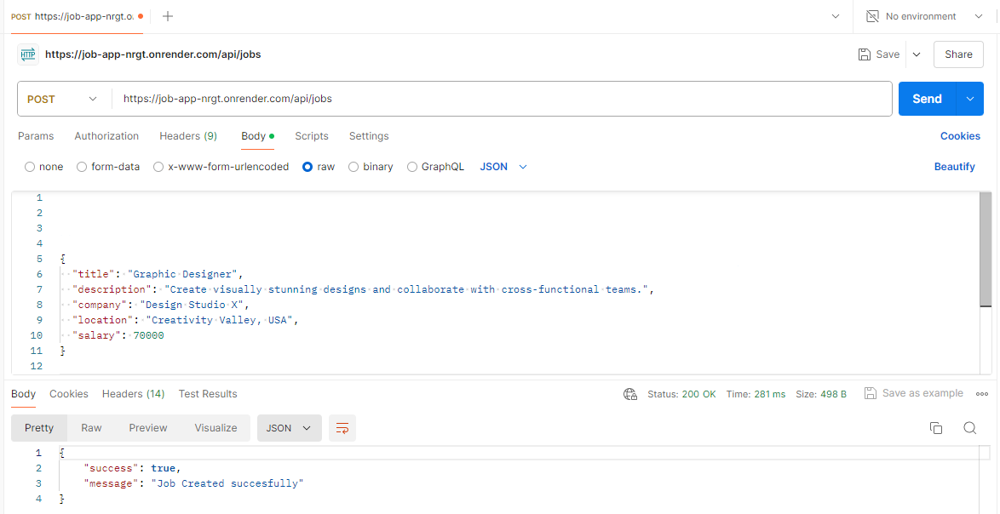 
 

#### List of avilable job
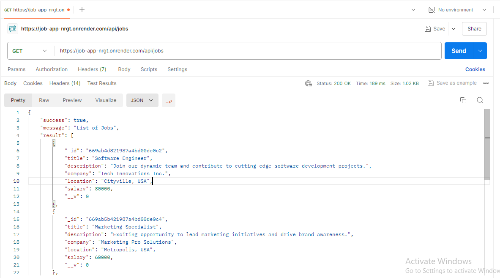 
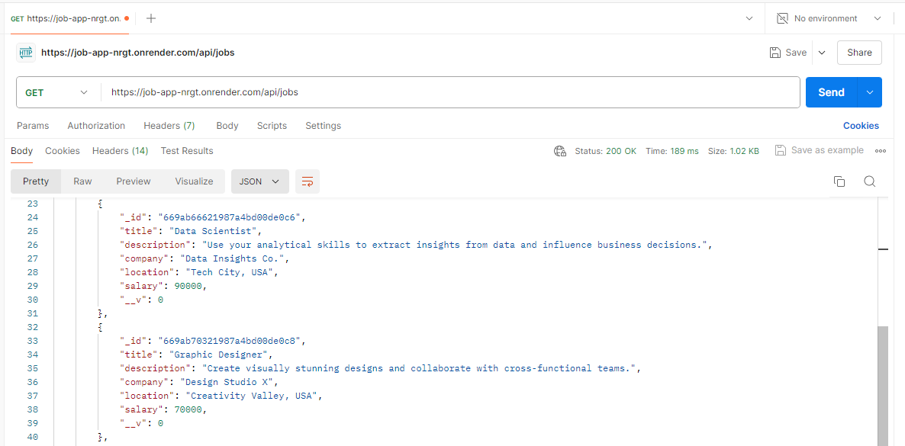 
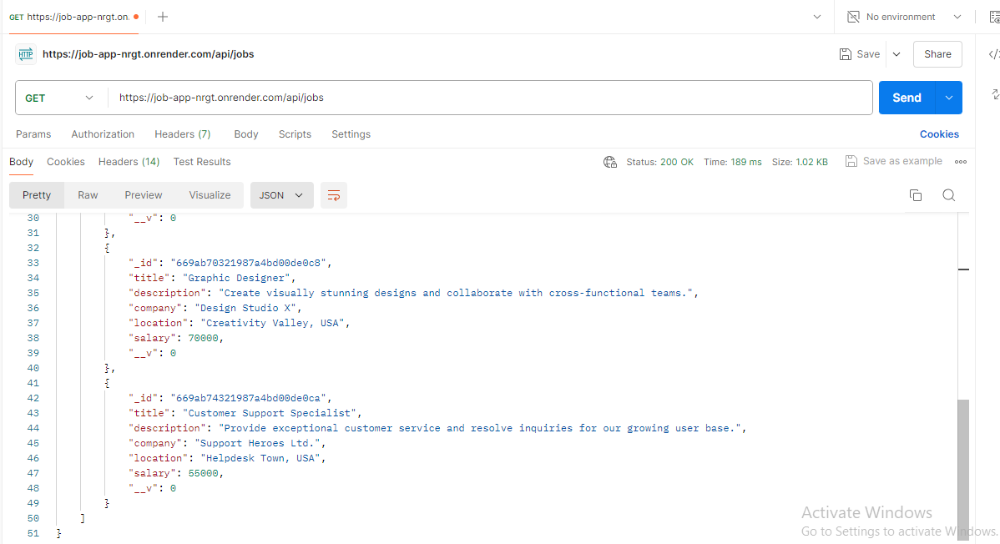 

#### Update job
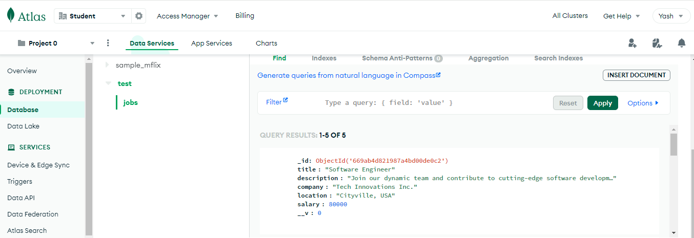 
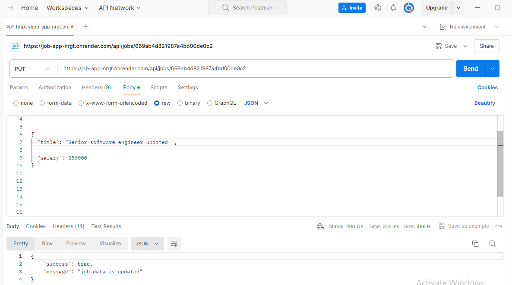
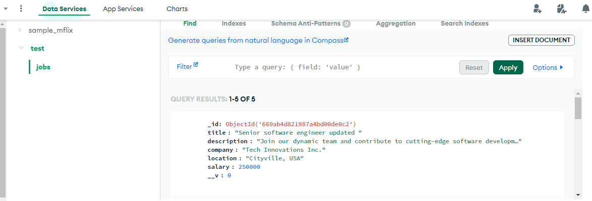 

#### Delete job
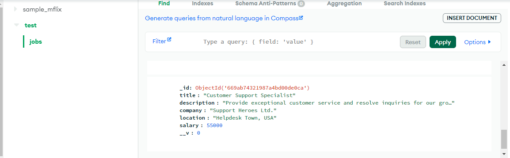
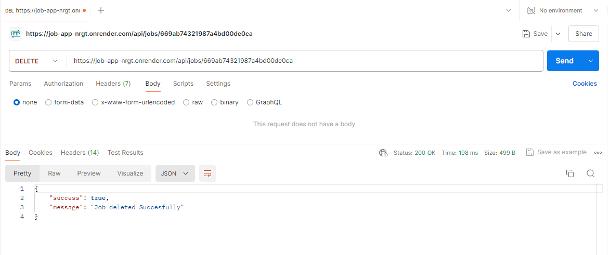

#### List of all job after delete
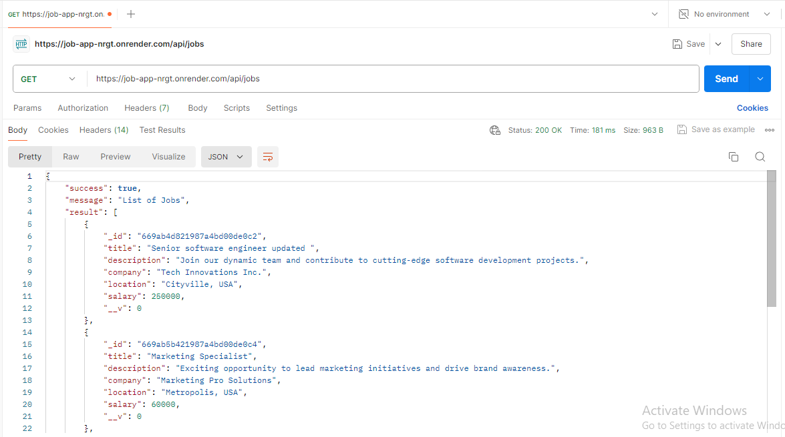
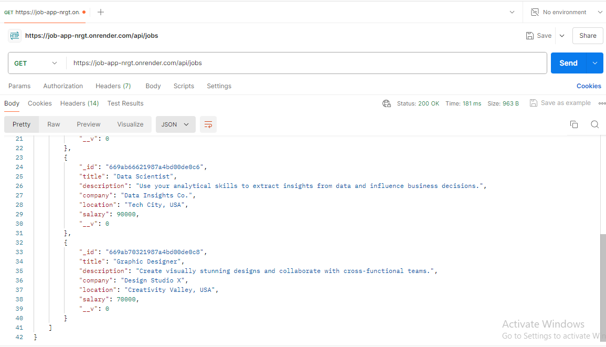
